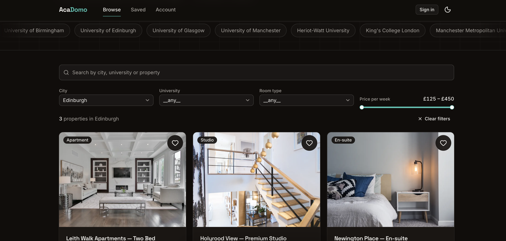

# AcaDomo

A student accommodation platform — search, compare, enquire, and manage leads.
Built as a full vertical slice: UI → API → database → auth → tests → deployment.

**[Live demo →](https://acadomo-mvp.vercel.app/)**

---

## What it does

Students browse verified accommodation, filter by city, university, room type
and weekly budget, and send an enquiry without creating an account. They can
optionally sign in with a one-time emailed code to shortlist properties and
track their enquiries. Staff sign in to a separate admin dashboard to work
through incoming leads.

It installs to a phone home screen as a PWA and works offline for browsing.

---

## Screenshots

> **TODO:** capture these four and drop them in `docs/images/`.
> 1. `listing-desktop.png` — home page, a filter applied, results visible
> 2. `detail-mobile.png` — a property page at 375px width
> 3. `admin.png` — the admin dashboard with a few enquiries
> 4. `installed.png` — the app running standalone on a phone home screen
>
> Then delete this block.

| Listing | Property detail |
| --- | --- |
|  |  |

| Admin dashboard | Installed as an app |
| --- | --- |
|  |  |

---

## Try it

**As a student:** open the [live demo](https://acadomo-mvp.vercel.app/), filter
by city or university, open a property, send an enquiry.

**As staff:** sign in with the same form. Staff get their own shell — Enquiries
and Properties, no student tabs. Both lists have search, filters, sorting and
pagination; properties can be created, edited, and shown/hidden. Enter a staff email and it asks for a
password instead of a code, then lands on the admin dashboard where enquiries can
be marked contacted. Credentials available on request.

**One sign-in form handles both.** You enter an email; the server decides whether
that address needs a password or a one-time code. Student addresses reveal
nothing either way — an unregistered address and a registered one both return
"code".

**Install it:** Chrome on Android offers "Add to Home Screen". On iOS, use
Share → Add to Home Screen. It launches standalone, with no browser chrome.

---

## Stack, and why

| Layer | Choice | Why |
| --- | --- | --- |
| Framework | Next.js 16 (App Router) | React and Node in one deployable — no CORS, no second service to operate |
| Language | TypeScript | Strict throughout; no `any` |
| UI | Tailwind v4 + shadcn/ui | Composed from primitives; the time went into the backend |
| Database | PostgreSQL (Supabase) | Relational data with real constraints |
| Data access | `pg` + hand-written SQL | **No ORM** — query design is the skill being shown |
| Validation | Zod | One schema shared by client and server |
| Auth | `jose` JWT in httpOnly cookies | Two separate realms: admin and student |
| Email | Resend | One-time sign-in codes |
| Tests | Vitest | 129 tests over the security-relevant logic |
| Hosting | Vercel | Git push deploys; preview URL per branch |

---

## Architecture

A single Next.js app, deliberately layered so the backend is legible as a
backend rather than scattered through route handlers.

```
app/
  api/**/route.ts     thin controllers: validate → authorize → delegate → respond
  (pages)             Server Components; query the database directly
lib/
  services/           business rules — plain functions, no Request/Response
  db/queries.ts       ALL SQL lives here, every value parameterized
  auth.ts             JWT signing/verification, password + session handling
  validation.ts       Zod schemas shared by client and server
db/
  schema.sql          6 tables, 9 explicit indexes, CHECK constraints
  seed.ts             59 properties / 10 cities / 22 universities, 341 enquiries
public/sw.js          hand-written service worker
```

**Three rules hold this together:**

1. A route handler contains **no SQL** and no business logic beyond
   validate → authorize → delegate → respond.
2. A service never touches `Request`/`Response`, so it stays testable.
3. Every value reaching SQL is a `$n` parameter. Identifiers (sort columns)
   come from an allowlist, never from user input.

That layering means extracting a standalone Express API would be a mechanical
move, not a rewrite. It stayed one deployable because two services would have
added CORS, cross-origin cookies, and a second deploy target for no gain here.

### Data model

```
properties      id, slug, title, city, country, university,
                price_per_week (integer minor units), room_type,
                amenities text[], image_url, is_active, updated_at
enquiries       property_id FK, student_id FK (nullable), name, email,
                phone, message, status (new | contacted)
students        email (citext, unique), name, email_verified_at
otp_codes       email, code_hash, expires_at, attempts, consumed_at
admin_users     email (citext, unique), password_hash, role
saved_properties  (student_id, property_id) composite PK
```

Money is stored as an **integer in minor units** — floats cannot represent
`0.1 + 0.2` exactly, so they have no place in a price column. Emails use
`citext` so `Alice@x.com` and `alice@x.com` cannot both exist.

---

## Security

The decisions here were the point of the project, not an afterthought.

**SQL injection** — every value is parameterized. `ORDER BY` cannot be
parameterized in SQL, so sort keys map through an allowlist object; an unknown
key never reaches the query. Verified by firing `'; DROP TABLE properties; --`
and friends at the live filters: they are treated as literal search text.

**Passwords** — bcrypt at cost 12. The hash is selected by exactly one query,
used only for authentication, and never returned in a response.

**No user enumeration** — a wrong password and an unknown email return an
identical message, and login always runs a bcrypt comparison (against a dummy
hash when the account does not exist) so response time cannot distinguish them.

**Sessions** — JWTs in `httpOnly`, `Secure`, `SameSite=lax` cookies; never
`localStorage`. Admin and student tokens carry a `realm` claim and use different
cookie names, so a valid student token cannot satisfy an admin check.

**Authorization** — middleware redirects unauthenticated users, but it is UX
only. Every admin route handler and page re-verifies the session itself. A
forged, expired, or wrong-realm token is rejected at that layer even though the
cookie exists.

**One-time codes are credentials** — generated with `crypto.randomInt`, stored
bcrypt-hashed, expiring in 10 minutes (enforced in SQL, not JS), capped at 5
attempts, single-use inside a transaction, and throttled per email and per IP.
Five wrong guesses burns the code, so the correct one stops working too.

**Demo mode** — with `NEXT_PUBLIC_DEMO_OTP=1` the sign-in code is shown in the
UI instead of emailed, so the flow is demonstrable without an email provider.
This is account takeover if enabled for real users, so it is off by default,
requires the exact value `1`, and is **force-disabled the moment
`RESEND_API_KEY` is set** — real email and code-leaking can never both be on.
Five tests cover that gate.

**Property visibility** — hiding a listing is a soft `is_active = false`, and
the filter is applied **in the query layer**: the listing, detail page, detail
API, filter dropdowns, saved shortlist and the enquiry endpoint all reject
hidden rows. The UI omitting a row is never the boundary. Soft-disable also
keeps enquiry history intact for analytics.

**Service worker** — never caches `/api/auth/*`, `/api/admin/*`, `/api/saved/*`,
any authenticated page, or any non-GET request. A cached authenticated response
would be served to whoever opened the app next.

**Transport** — TLS to Postgres is verified against a pinned Supabase root CA,
not merely encrypted.

---

## Running locally

**Requires** Node 20+ and PostgreSQL 14+.

```bash
git clone <repo-url> && cd Acadomo-MVP
npm install

cp .env.example .env.local          # then fill in the values

createdb acadomo_dev
npm run db:reset                    # apply schema
npm run db:seed                     # 59 properties, 341 enquiries, admin user

npm run dev
```

Minimum `.env.local` to boot:

```bash
DATABASE_URL=postgresql://YOUR_USER@localhost:5432/acadomo_dev
JWT_SECRET=$(openssl rand -base64 32)
ADMIN_EMAIL=admin@acadomo.local
ADMIN_PASSWORD=choose-something
```

`RESEND_API_KEY` is optional locally — **without it, sign-in codes print to the
terminal** instead of being emailed, so the whole flow is testable with no
provider account. In production a missing key throws rather than falling back,
so codes can never leak into server logs.

Set `NEXT_PUBLIC_DEMO_OTP=1` to show the code in the UI instead — useful for a
demo deployment with no email provider. See the security note above before
enabling it anywhere real.

| Script | |
| --- | --- |
| `npm run dev` | Dev server |
| `npm test` | 129 tests |
| `npm run db:check` | Verify DB connection and TLS |
| `npm run db:reset` / `db:seed` | Rebuild and populate |
| `npm run lint` / `typecheck` | Static checks |

---

## Tests

129 tests, deliberately narrow. They cover the logic where a bug is a
*vulnerability* rather than a visual glitch:

- **OTP** — expiry, the 5-attempt cap, single-use, and that a correct code is
  rejected after lockout
- **SQL building** — injection payloads reach the params array and never the
  query string
- **Validation** — every schema, plus the redirect guard that blocks
  `//evil.com` and `https://evil.com`
- **Service worker** — the full list of routes that must never be cached
- **Demo mode** — that leaking the code stays off unless explicitly enabled and
  is disabled automatically once real email is configured
- **Property visibility** — that the active filter survives alongside other
  filters and can only be bypassed by an explicit admin opt-in
- **Admin list filters** — enquiry and property WHERE builders: placeholder
  numbering, date ranges passed as parameters, injection payloads kept out of
  the SQL string
- **Auth** — bcrypt round-trip, rate limiting

**Not covered:** component rendering and end-to-end browser flows. Those were
verified by hand. Playwright would be the next addition.

---

## Deliberately out of scope

Cut scope is a decision, not an omission. Each of these was considered:

| Not built | Why |
| --- | --- |
| Payment gateway | Integration work; proves vendor docs were read, not that the slice was built |
| Google Maps | University and city filters already cover discovery; a map adds an API key and no demo value |
| CRM integration | No interview value at this scale |
| Image upload | Storage plumbing; seeded URLs make the same point |
| SMS notifications | Second provider, same pattern as email |
| i18n | Real work, zero signal here |

---

## What I would build next

1. **Analytics dashboard** — views, enquiry conversion, breakdowns by city and
   university. Aggregated in SQL (`GROUP BY`, `date_trunc`, window functions),
   which makes it a query-design exercise rather than a charting one.
2. **Multi-admin with policy-based access** — a central
   `can(user, action, resource)` function instead of role strings scattered
   through handlers, plus an audit log.
3. **Property-owner workflow** — owners submit listings, admins approve, only
   approved listings reach students, enforced in the query layer.
4. **Push notifications and offline enquiry queue** — IndexedDB plus Background
   Sync, with an idempotency key so a flushed queue cannot double-submit.
5. **Playwright** for the browser flows the unit tests do not reach.
6. **Shared-store rate limiting** — the current limiter is in-memory, which is
   correct for one instance and wrong at scale. It is isolated to one file.

---

## Notes

**On the frontend:** I am a backend developer who does applied frontend, and
this is built that way on purpose. The UI is composed from shadcn/ui primitives
rather than hand-rolled, so the engineering time went into SQL, auth, validation
and service layering. Reaching for a component library is what I would do on a
real team.

**On filter state:** filters live in the URL, so results are shareable and the
back button works. Controls read through `useOptimistic` rather than
`searchParams` directly — `router.push` inside a transition leaves the URL stale
until the server responds, so a control bound to it shows the old value for the
whole round-trip and then snaps.

**On the rate limiter:** in-memory, so counters reset on cold start and are not
shared across instances. Correct for a single-instance deployment, wrong at
scale, and swapping in Redis means replacing one file.

**On the PWA:** the service worker is hand-written. `next-pwa` requires webpack
(this builds with Turbopack) and has been unmaintained since late 2024. A
service worker is a JS file; the libraries exist to generate precache manifests,
which an app this size does not need.
